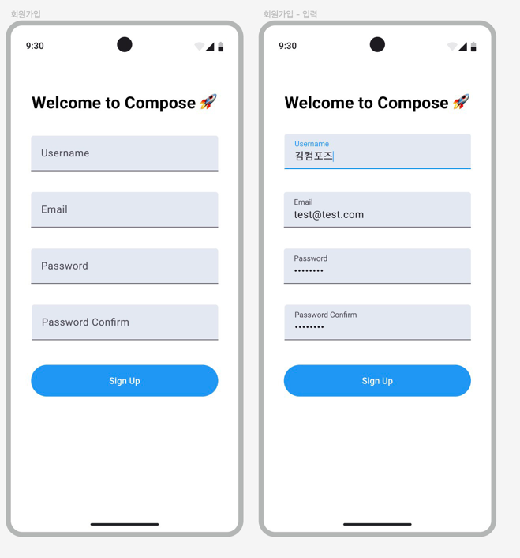

# android-signup# android-signup

## Step 1

컴포즈 학습 테스트

- [x] LayoutBasicsTest 의 테스트를 모두 성공 시킨다.
- [x] Preview를 노출시킨다.
- [x] Preview의 interactive 모드를 활용하여 버튼을 클릭해본다.

## Step 2

- [x] Colors, colorScheme 를 정의한다.
- [x] 기본 SignUpTextField 를 만든다.
- [x] UserName, Email, Password, Password Confirm TextField를 화면에 배치한다.
- [x] 화면 밖에 터치하면 focus clear 되도록 한다.
- [x] Password 와 Password Confirm 는 PassWord KeyBoard Options 를 준다.
- [x] SignUp 버튼을 화면에 배치한다.
- [x] rememberSaveable 을 사용하여 회원가입 폼 상태를 저장한다.
