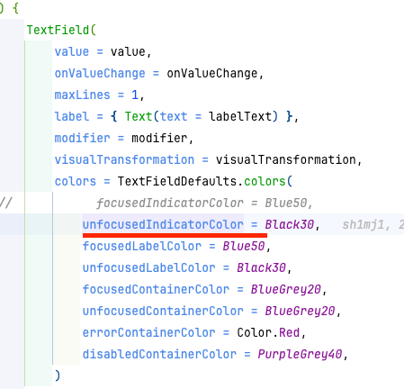
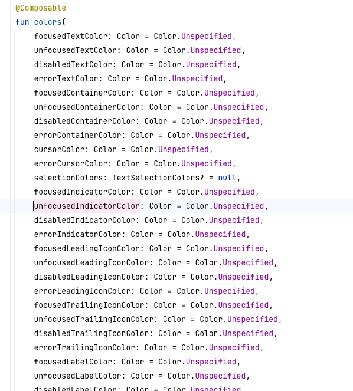
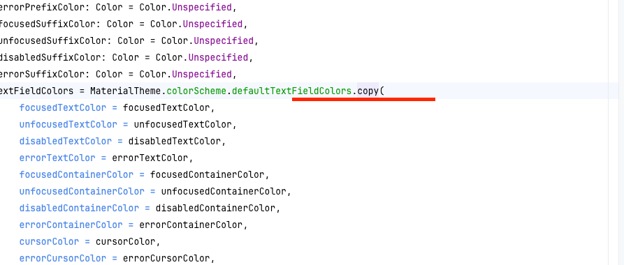
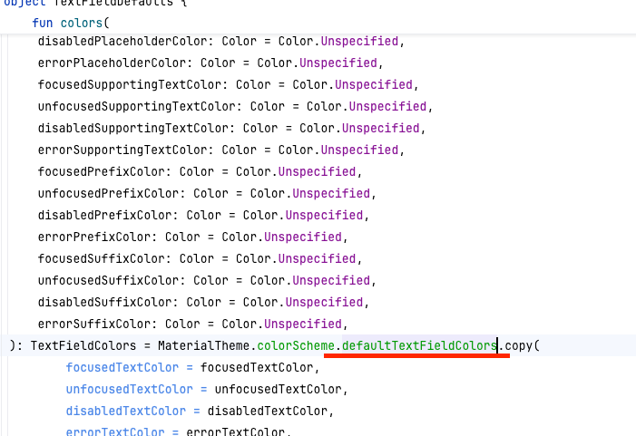
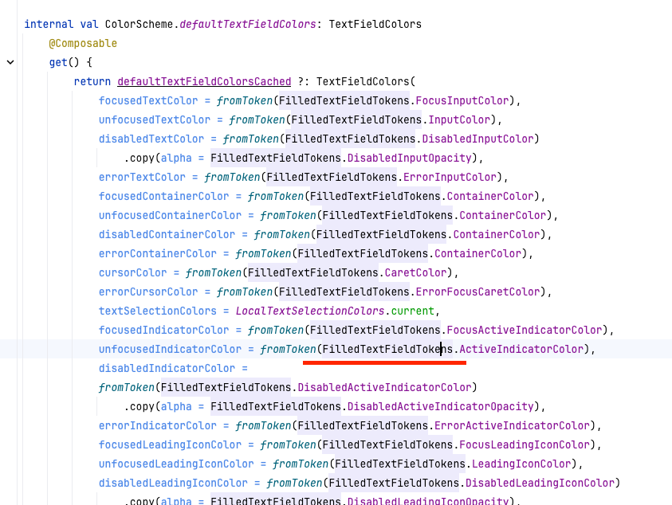
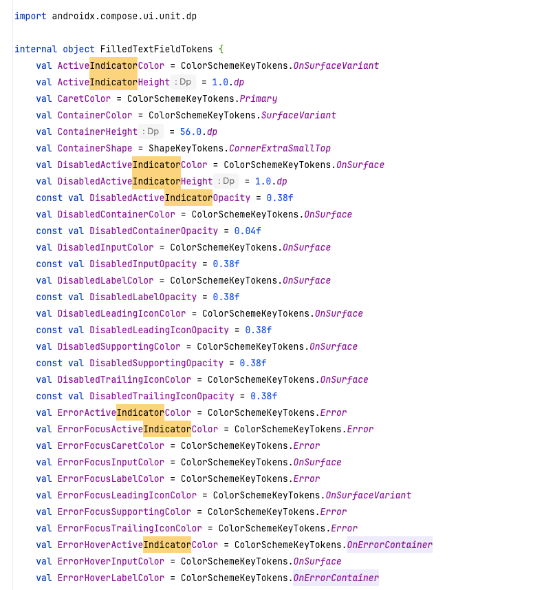

# android-signup# android-signup

# step1

- [x] 학습 테스트 완성

# step2

- [x] 디자인 시안을 참고하여 회원가입 뷰를 구현한다.

- [x] ViewModel, Hilt 등은 회원가입 미션에서 활용하지 않는다. 컴포즈 학습에 집중하자.
- [x] 사용자 입력 및 유효성 검사에 대해서는 이 단계에서 고민하지 않아도 된다.
- [x] 컴포저블 함수가 너무 많은 일을 하지 않도록 분리하기 위해 노력해 본다.
- [x] Material3 Button, TextField를 활용한다.

## step2 피드백

- [ ] TextField 의 배경색을 피그마 시안에 맞도록

Color 설정

```kotlin
package nextstep.signup.ui.theme

import androidx.compose.ui.graphics.Color

val BlueGrey20 = Color(0xFFE3E8F1)
```

| 특징            | xml 기반                          | kotlin 기반 (Compose)                                  |
|---------------|---------------------------------|------------------------------------------------------|
| 색상 정의 위치      | colors.xml 리소스 파일               | kotlin 파일 (보통 Color.kt 등)                            |
| 사용 방식         | xml 또는 ContextCompat.getColor() | Composable 함수 내에서 바로 참조 가능                           |
| 유연성           | 리소스 파일로 관리, 리소스 ID 필요           | kotlin 코드에서 즉시 정의 및 사용 가능                            |
| 상태 관리 및 동적 변경 | 변경이 어렵고 리소스 id 로 고정됨            | 색상을 동적으로 변경하거나 상태에 맞게 조정 가능 (예를 들어, 다크 모드나 동적 테마 변경) |
| 명확성 및 구조      | 색상 정의가 xml 에 고정, UI 와 코드 분리     | 코드와 Ui 가 같은 파일에서 처리될 수 잇음.                           |

TextField 의 배경 색 변경

```kotlin
TextField(
    /*...*/
    colors = TextFieldDefaults.colors(
        focusedContainerColor = BlueGrey20,
        unfocusedContainerColor = BlueGrey20,
        errorContainerColor = Color.Red,
        disabledContainerColor = PurpleGrey40,
    ),
)
```

이런 식으로 해야 하나?
focusedContainerColor, unfocusedContainerColor, errorContainerColor, disabledContainerColor 를 한번에 해줄 수 없나?

그런데 내가 직접 지정을 안 해줘도 처음부터 기본 색상이 들어가잖아.
즉, 기본 테마 색상을 내가 지정하면 여기서 직접 해주지 않아도 된다는 뜻?

이렇게 해서 찾아서 해주면 된다~













```kotlin
private val LightColorScheme = lightColorScheme(
    primary = Blue50,
    secondary = PurpleGrey40,
    tertiary = Pink40,
    surfaceVariant = BlueGrey20,
    onSurfaceVariant = Black30,
)

@Composable
fun SignupTheme(
    darkTheme: Boolean = isSystemInDarkTheme(),
    content: @Composable () -> Unit
) {
    val colorScheme = when {
        darkTheme -> DarkColorScheme
        else -> LightColorScheme
    }

    MaterialTheme(
        colorScheme = colorScheme,
        typography = Typography,
        content = content
    )
}

```