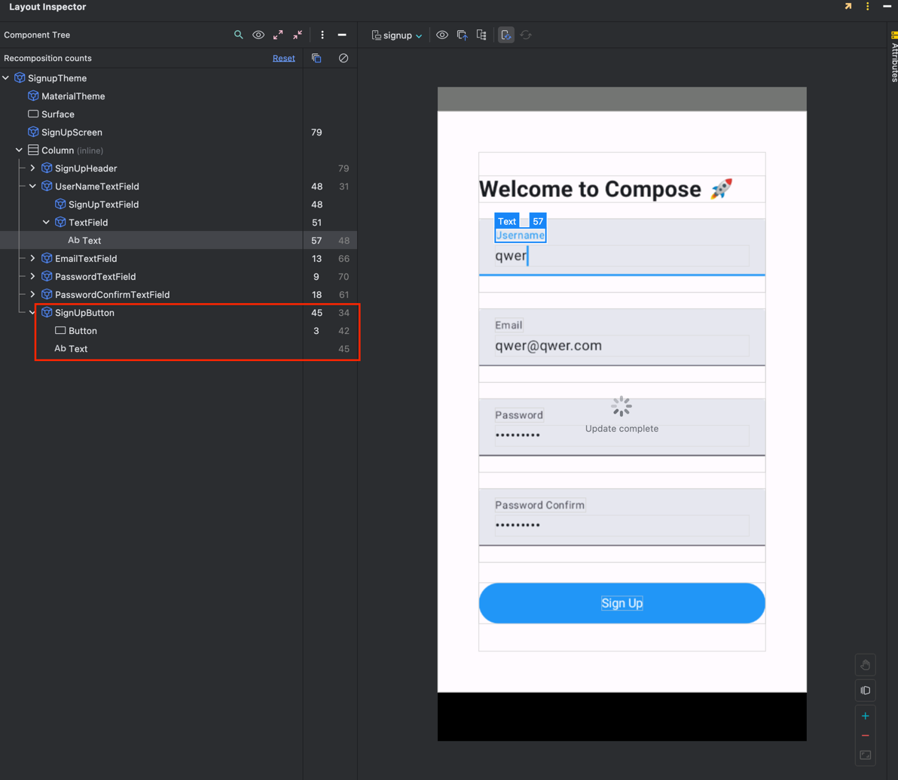
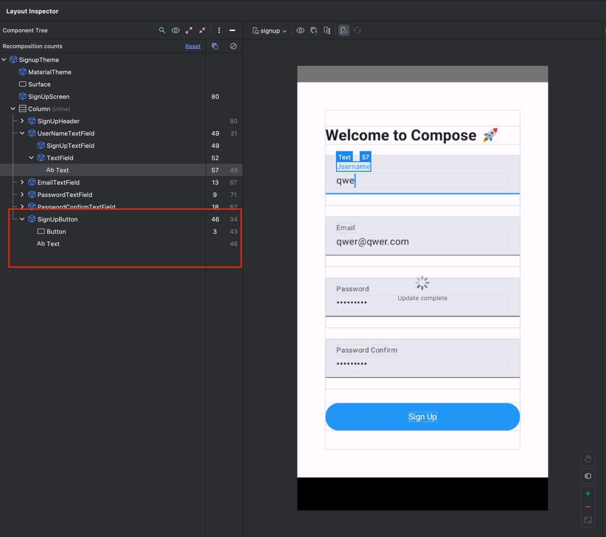

```kotlin
@Composable
fun KimposeKKmPose(modifier: Modifier = Modifier.testTag("이름")) {
    Column(
        modifier = modifier
    ) {
        // 바꿔 보세요!
        Text(text = "킴포즈", color = Color.Cyan)
        Text(text = "끔포즈", color = Color.Yellow)
    }
}
```

> Optional Modifier parameter should have a default value of `Modifier`

# Modifier 가 뭔데

An ordered, immutable collection of modifier elements that decorate or add behavior to Compose UI elements. For example,
backgrounds, padding and click event listeners decorate or add behavior to rows, text or buttons.
순서가 있는 변경 불가한 modifier 원소 들의 콜렉이다.
이 원소들은 Compose UI elements 를 꾸며주거나 행동을 추가해준다.
예를 들어 배경, padding, 클릭 이벤트 리스너가 rows, text, 버튼을 꾸며주거나 행동을 추가할 수 있다.

왜 그렇지?
Modifier는 Composable 함수에서 기본적으로 제공되는 확장 가능하고 체인할 수 있는 객체

Modifier는 기본적으로 빈 객체(Modifier)로 정의하는 것이 관례이며,
특정 값을 기본으로 설정하는 대신 Modifier를 호출 시 덮어쓸 수 있게 제공하는 것이 Compose 스타일 가이드야.

* 빈 Modifier를 기본값으로 해야 하는 이유:
    * 컴포저블 함수가 호출될 때 외부에서 수정 및 확장 가능하게 하기 위해.
* 체이닝을 사용하는 이유:
    * 외부에서 전달된 Modifier를 덮어쓰지 않고, 추가적인 동작을 결합해 유연하게 사용할 수 있도록 하기 위해.

# Style guidelines for Jetpack Compose APIs

영상 참고  [Designing scalable Compose APIs](https://developer.android.com/develop/ui/compose/api-guidelines)

좋은 컴포즈 코드 -> more scalable, eaier to evolve with minumum friction, more consistent across Compose ecosystem, ...

Think and plan,
Name and structure
Verify and maintain

Planning

### Single component or layering?

consistent requirement for more opinionated APIs -> Higher level API

Defines a common surface and expectations -> Lower level API

stateful vs stateless

Color 설정

```kotlin
package nextstep.signup.ui.theme

import androidx.compose.ui.graphics.Color

val BlueGrey20 = Color(0xFFE3E8F1)
```

| 특징            | xml 기반                          | kotlin 기반 (Compose)                                  |
|---------------|---------------------------------|------------------------------------------------------|
| 색상 정의 위치      | colors.xml 리소스 파일               | kotlin 파일 (보통 Color.kt 등)                            |
| 사용 방식         | xml 또는 ContextCompat.getColor() | Composable 함수 내에서 바로 참조 가능                           |
| 유연성           | 리소스 파일로 관리, 리소스 ID 필요           | kotlin 코드에서 즉시 정의 및 사용 가능                            |
| 상태 관리 및 동적 변경 | 변경이 어렵고 리소스 id 로 고정됨            | 색상을 동적으로 변경하거나 상태에 맞게 조정 가능 (예를 들어, 다크 모드나 동적 테마 변경) |
| 명확성 및 구조      | 색상 정의가 xml 에 고정, UI 와 코드 분리     | 코드와 Ui 가 같은 파일에서 처리될 수 잇음.                           |

TextField 의 배경 색 변경

```kotlin
TextField(
    /*...*/
    colors = TextFieldDefaults.colors(
        focusedContainerColor = BlueGrey20,
        unfocusedContainerColor = BlueGrey20,
        errorContainerColor = Color.Red,
        disabledContainerColor = PurpleGrey40,
    ),
)
```

이런 식으로 해야 하나?
focusedContainerColor, unfocusedContainerColor, errorContainerColor, disabledContainerColor 를 한번에 해줄 수 없나?

그런데 내가 직접 지정을 안 해줘도 처음부터 기본 색상이 들어가잖아.
즉, 기본 테마 색상을 내가 지정하면 여기서 직접 해주지 않아도 된다는 뜻?

이렇게 해서 찾아서 해주면 된다~






```kotlin
private val LightColorScheme = lightColorScheme(
    primary = Blue50,
    secondary = PurpleGrey40,
    tertiary = Pink40,
    surfaceVariant = BlueGrey20,
    onSurfaceVariant = Black30,
)

@Composable
fun SignupTheme(
    darkTheme: Boolean = isSystemInDarkTheme(),
    content: @Composable () -> Unit
) {
    val colorScheme = when {
        darkTheme -> DarkColorScheme
        else -> LightColorScheme
    }

    MaterialTheme(
        colorScheme = colorScheme,
        typography = Typography,
        content = content
    )
}

```

# remember 두개

```kotlin
val userNameResult: UserNameResult by remember(name) {
    mutableStateOf(UserName.from(name))
}

val userNameResult: UserNameResult by remember {
    mutableStateOf(UserName.from(name))
}
```

두 코드 차이는 remember 의 종속성
remember 는 특정 값이나 상태를 메모리에 저장하고 컴포저블이 재구성(recomposition)될 대 기존 값을 유지한다.

### 1. **`remember(name)`**

```kotlin
val userNameResult: UserNameResult by remember(name) {
    mutableStateOf(UserName.from(name))
}
```

- 동작 원리: `remember(name)`는 `name` 값이 변경될 때마다 새로운 `userNameResult`를 계산하고 메모리에 저장한다
- 종속성 추가: 이 코드에서는 `name`을 `remember`의 종속성으로 추가했기 때문에, `name`이 바뀔 때마다 `UserName.from(name)`을 다시 호출하여 새로운 `userNameResult`
  를 생성한다
- 사용 시기: `name` 값이 변경되면 새로운 결과를 얻어야 하는 경우.

### 2. **`remember` (종속성 없음)**

```kotlin
val userNameResult: UserNameResult by remember {
    mutableStateOf(UserName.from(name))
}
```

- 동작 원리: 종속성을 추가하지 않은 이 `remember`는 컴포저블이 처음 재구성될 때 한 번만 `UserName.from(name)`을 호출, 그 이후로는 `name`이 변경되더라도 다시 계산하지 않는다
- 종속성 없음: 여기서는 `remember`에 종속성을 지정하지 않았기 때문에, `name` 값이 바뀌더라도 다시 계산되지 않는다. 따라서 `name`이 바뀌더라도 `userNameResult`는 처음 계산된 값을
  계속 유지한다.
- 사용 시기: `name`이 변경되어도 결과를 다시 계산할 필요가 없는 경우.

### **결론**:

- **`remember(name)`**: `name`이 변경될 때마다 `UserNameResult`를 다시 계산해야 할 때 사용.
- **`remember`**: 한 번만 계산하고 이후 값이 변하지 않거나, 상태를 계속 유지할 필요가 있을 때 사용.


